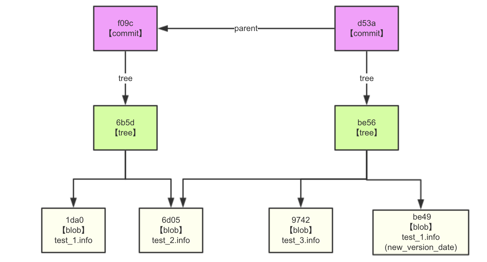

### 目标
根据实际使用，了解 git 如何存储数据

多次提交文件，生成多个版本的文档，可以回到某一个版本的数据中，git是如何做到这一点的？内部原理是什么？

下面用实际使用，来说明其中涉及到的知识点。

``` powershell
# 初始化git仓库
➜  codes git init git_test_2
Initialized empty Git repository in /Users/platfrom-test/Documents/taoyutong/codes/git_test_2/.git/

# 创建两个文件
➜  git_test_3 git:(master) echo 'tyt test ' >> test_1.info
➜  git_test_3 git:(master) ✗ echo 'tyt test in test_2 ' >> test_2.info

# 由于没有 git add ，objects 下没有记录，表示文件没有被 git 跟踪
➜  git_test_3 git:(master) ✗ find .git/objects -type f

# git add ， 查看 objects 下，存在了 blob object 
# blob object 中保存文件数据，是一个文件的version数据,如果一个文件修个了，会生成一个新的 blob object ，包含new version 数据
➜  git_test_3 git:(master) ✗ git add .
➜  git_test_3 git:(master) ✗ find .git/objects -type f
.git/objects/1d/a03542a068bd9e7162829aa366cf105059262f
.git/objects/6d/051ee5ef8c8821d630e6d7b7192a1ba9e657f8

➜  git_test_3 git:(master) ✗ git cat-file -t 1da03542a068bd9e7162829aa366cf105059262f
blob
➜  git_test_3 git:(master) ✗ git cat-file -t 6d051ee5ef8c8821d630e6d7b7192a1ba9e657f8
blob

# 查看文件内容
➜  git_test_3 git:(master) ✗ git cat-file -p 1da03542a068bd9e7162829aa366cf105059262f
tyt test 
➜  git_test_3 git:(master) ✗ git cat-file -p 6d051ee5ef8c8821d630e6d7b7192a1ba9e657f8
tyt test in test_2 

# commit 后，发现 objects 下面多了2个文件
➜  git_test_3 git:(master) ✗ git commit -m 'tyt commit 2 files '
➜  git_test_3 git:(master) find .git/objects -type f
.git/objects/1d/a03542a068bd9e7162829aa366cf105059262f
.git/objects/6b/5d31a66229cbb085ecae4fc72a1cf7371ad981
.git/objects/6d/051ee5ef8c8821d630e6d7b7192a1ba9e657f8
.git/objects/f0/9cc9771e6b8b2b2be46eef7c57373bfa020f76

# 查看文件类型后，发现是 commit object 和 tree object 
# 看下 tree object 
# tree object 包含内容：
# 1. 文件模式，是一些固定的值，如 100644 
# 2. blob 指向文件的类型
# 3. 指向文件的 sha1校验和
# 4. 指向文件的名称 
➜  git_test_3 git:(master) git cat-file -t 6b5d31a66229cbb085ecae4fc72a1cf7371ad981
tree
➜  git_test_3 git:(master) git cat-file -p 6b5d31a66229cbb085ecae4fc72a1cf7371ad981
100644 blob 1da03542a068bd9e7162829aa366cf105059262f	test_1.info
100644 blob 6d051ee5ef8c8821d630e6d7b7192a1ba9e657f8	test_2.info

# 看下 commit object 
# commit object 包含内容：
# 1. tree object sha1
# 2. author and committer info
# 3. commit comment 

➜  git_test_3 git:(master) git cat-file -t f09cc9771e6b8b2b2be46eef7c57373bfa020f76
commit

➜  git_test_3 git:(master) git cat-file -p f09cc9771e6b8b2b2be46eef7c57373bfa020f76
tree 6b5d31a66229cbb085ecae4fc72a1cf7371ad981
author platfrom-test <platfrom-test@platform-testdeMacBook-Pro.local> 1529322190 +0800
committer platfrom-test <platfrom-test@platform-testdeMacBook-Pro.local> 1529322190 +0800

tyt commit 2 files
```
到此，可以发现
**commit object** 是一次版本提交记录,记录中有指向本次版本的所有内容
**tree object** 中包含了 laster version data 的 blob object  
**blob object**中保存了版本数据

所有的指向，都是sha1校验和，根据校验和，可以在 git 的内容数据库（key-value）取得实际的内容.

**当多次提交时，又如何呢？**

```powershell
# 添加一个新文件 test_3.info, 同时修改 test_1.info
# git add ，git commit ，查看 .git/objects 中的文件
➜  git_test_3 git:(master) echo 'tyt test 3 '>> test_3.info
➜  git_test_3 git:(master) ✗ echo 'add some words' >> test_1.info 
➜  git_test_3 git:(master) ✗ git add .
➜  git_test_3 git:(master) ✗ git commit -m 'tyt modify 1 '
➜  git_test_3 git:(master) find .git/objects -type f
.git/objects/1d/a03542a068bd9e7162829aa366cf105059262f
.git/objects/6b/5d31a66229cbb085ecae4fc72a1cf7371ad981
.git/objects/6d/051ee5ef8c8821d630e6d7b7192a1ba9e657f8
.git/objects/97/420730ec1cb146771fb012a87a342cea978d41
.git/objects/be/49d831b987b3b033fbb7b46bc5be992f212790
.git/objects/be/56c3932a9e8bdf3d9f3d80080fe1ffdfb4de82
.git/objects/d5/3a0c3f746937717cd8942ae00dc6e3b18055a2
.git/objects/f0/9cc9771e6b8b2b2be46eef7c57373bfa020f76

# 查看各内容，发现
# 1. 用一个新的 blob object 保存新加的 test_3.info 
# 2. 用一个新的 blob object 保存修改后的 test_1.info
# 3. 用一个新的 tree object 保存了新版本的所有数据，该 tree object 指向了更新后的 test_3.info、test_1.info 对应的 blob object 的 sha1校验和，由于 test_2.info 文件并没有改变，因此还指向原来的那个 blob object
# 4. 用一个新的 commit object 保存了第二次提交的信息，该 commit object 中的 tree 指针，指向的是最新的 tree object
# 由此可以保证，每次 commit，都能关联到最新的数据
➜  git_test_3 git:(master) git cat-file -p 97420730ec1cb146771fb012a87a342cea978d41
tyt test 3 
➜  git_test_3 git:(master) git cat-file -p be49d831b987b3b033fbb7b46bc5be992f212790
tyt test 
add some words
➜  git_test_3 git:(master) git cat-file -p be56c3932a9e8bdf3d9f3d80080fe1ffdfb4de82
100644 blob be49d831b987b3b033fbb7b46bc5be992f212790	test_1.info
100644 blob 6d051ee5ef8c8821d630e6d7b7192a1ba9e657f8	test_2.info
100644 blob 97420730ec1cb146771fb012a87a342cea978d41	test_3.info
➜  git_test_3 git:(master) git cat-file -p d53a0c3f746937717cd8942ae00dc6e3b18055a2
tree be56c3932a9e8bdf3d9f3d80080fe1ffdfb4de82
parent f09cc9771e6b8b2b2be46eef7c57373bfa020f76
author platfrom-test <platfrom-test@platform-testdeMacBook-Pro.local> 1529323368 +0800
committer platfrom-test <platfrom-test@platform-testdeMacBook-Pro.local> 1529323368 +0800

tyt modify 1

```

**用图来理解上述过程的关联关系**



查看提交历史，实际上就是查看 commit object 链

```powershell

commit d53a0c3f746937717cd8942ae00dc6e3b18055a2
Author: platfrom-test <platfrom-test@platform-testdeMacBook-Pro.local>
Date:   Mon Jun 18 20:02:48 2018 +0800

    tyt modify 1

commit f09cc9771e6b8b2b2be46eef7c57373bfa020f76
Author: platfrom-test <platfrom-test@platform-testdeMacBook-Pro.local>
Date:   Mon Jun 18 19:43:10 2018 +0800

    tyt commit 2 files
(END)


```


###### 总结下涉及的知识点
